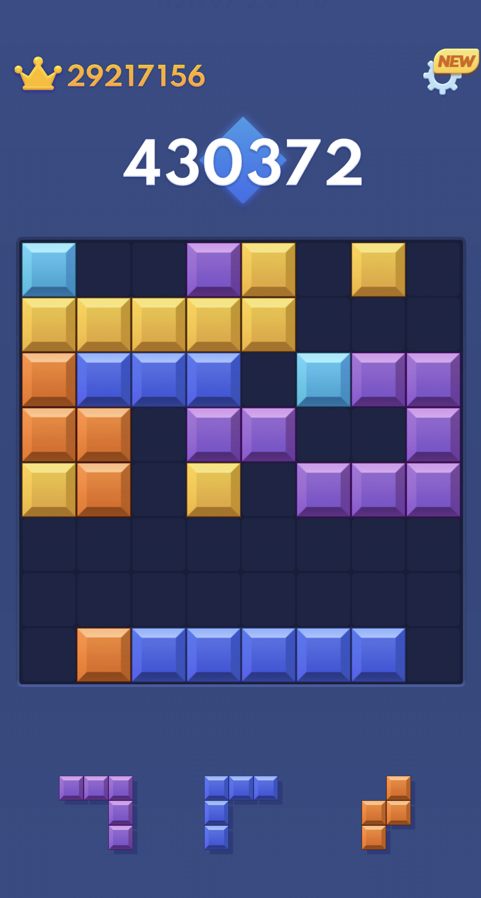

# Block Blast Agent
An autonomous AI agent which can achieve superhuman scores.

  
🏆 Current High Score: 29,000,000+

## About
This script plays the popular mobile game Block Blast entirely on its own, through iPhone Mirroring. It uses computer vision to see the board, internal logic to decide on a move sequence, and then plays out the move sequence using PyAutoGUI.

## Key Features
* **Deep Learning Evaluation:** For each position, the script decides what move to make based on a search algorithm + Convolutional Neural Network to evaluate end positions.
* **Self-Play Optimization:** Using data from playing the game, I was able to artificially reproduce Block Blast. Then, I trained a network based on self-play in this simulated environment, to learn which positions are good or bad.
* **Precision Input Control:** The script controls the mouse to simulate dragging tiles in the game.

## Technical Stack
* **Language:** Python 3.13
* **Neural Network:** Tensorflow
* **Computer Vision:** OpenCV, Pillow
* **Automation:** PyAutoGUI, Pynput
